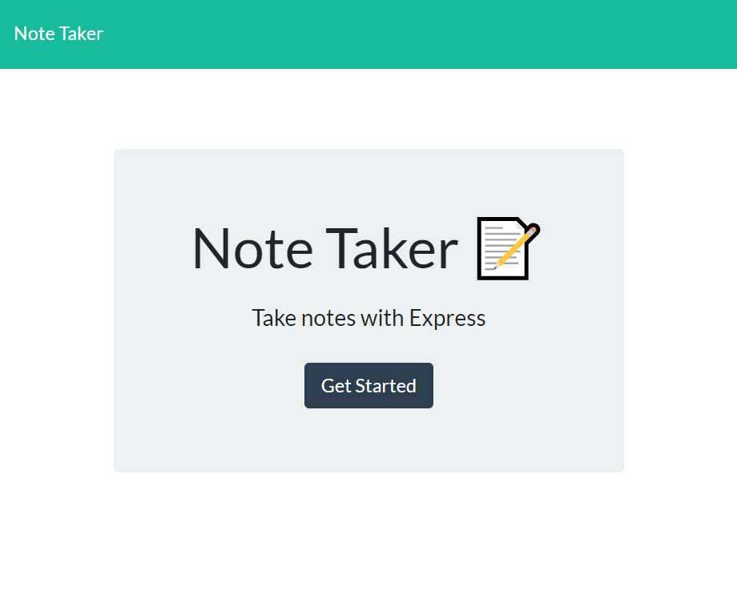
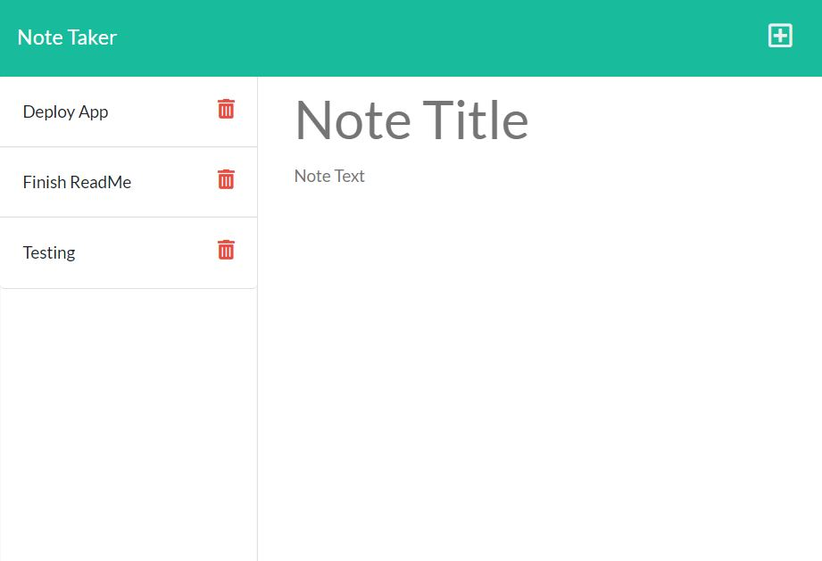

# Express Note Taker

  
  
  ## Description

  [View deployed application](https://mighty-headland-38310.herokuapp.com/)
  
  This memorandum or note application using an express server to read and display saved notes, create new notes, and delete notes that are no longer needed. It uses different routes to get, post, and delete and also includes a static route to serve the CSS and front-end javascript.
  
  ## Table of Contents
  
  * [Description](#description)
  * [Installation](#installation)
  * [Usage](#usage)
  * [Tests](#tests)
  * [Future Features](#future)
  * [Contributing](#contributing)
  * [License](#license)
  * [Questions](#questions)
    
  ## Installation
  Run npm i
  
  ## Usage
  1. Navigate to url
  1. Push button to get started
  
  1. Enter a new note title and message
  1. Push the save button at the top
  1. Recall saved notes by clicking on the note tile in left column
  1. Push delete button next to any note you would like to delete
  
  
  
  ## Future
  I would like to add another route to update notes. I would also like to create an actual database to save notes into, which would make the update process much easier and make all of the other processes run smoother as well.
  
  ## License
  [MIT License](https://choosealicense.com/licenses/mit/)
  
  ## Contributing
  To contribute to this repo:
  1. Fork the repo
  1. Make changes to forked repo
  1. Submit pull request to this repo
  
  ## Tests
  no tests
  
  ## Questions
  
  For more information:
  Visit my GitHub: [https://rsowald.github.io](https://rsowald.github.io)

  or Email: renaesowald@gmail.com